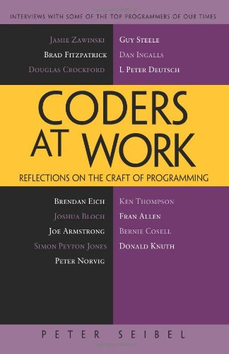
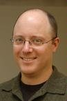

# Introduction to 

# 
 *Coders at Work*

---

# Coders at Work

published in 2009

---

# About the author

*Peter Seibel* is either a writer turned programmer or programmer turned writer. After picking up an undergraduate degree in English and working briefly as a journalist, he was seduced by the web. In the early '90s he hacked Perl for Mother Jones magazine and Organic Online. He participated in the Java revolution as an early employee at WebLogic and later taught Java programming at UC Berkeley Extension. Peter is also one of the few second-generation Lisp programmers on the planet and was a childhood shareholder in Symbolics, Inc.

In 2003 he quit his job as the architect of a Java-based transactional messaging system to hack Lisp for a year. Instead he ended up spending two years writing a book, the Jolt Productivity Award winning Practical Common Lisp. His most recent book is Coders at Work, a collection of Q&A interviews with fifteen notable programmers and computer scientists.

From <http://www.amazon.com/Peter-Seibel/e/B001K8ECUU/>

----

# My Impression

*	15 interviews
*	a lot of oral
*	really owewsome people

----

# Acknowledgments

Interesting expressions

----

# Jamie Zawinski's profile

*	Lisp hacker, early Netscape developer, and nightclub owner
*	worked in the Lisp and AI world for nearly a decade
*	He worked at UC Berkeley for Peter Norvig
*	at Lucid leading the development of Lucid Emacs, later renamed XEmacs
*	In 1994 he joined Netscape as one of the original developers of the Unix version of the Netscape browser and later of the Netscape mail reader

----

# Jamie Zawinski's topics

*	debug GDB
*	a lot on programming and languages
*	Perl & C++
*	"we’d had an impact on people’s lives"
*	second-system syndrome
	-	see <http://en.wikipedia.org/wiki/Second-system_effect>
*	reminds me on netscape
*	overengineering
*	XScreenSaver
*	how to debug
*	testing
*	maintaining
*	code organization
*	team organization
*	recognize talent
*	somewhere between craftsman and artist
*	books for programmers
	-	Structure and Interpretation of Computer Programs
	-	book on debugging by someone from MS
	-	Design Patterns
	-	The Art of Computer Programming

----

# Brad Fitzpatrick's profile

*	Born in 1980, learn to program at five
*	start LiveJournal before college
*	open source software, including memcached, Perlbal, and MogileFS

----

# Brad Fitzpatrick's topics

*	CGI in Perl
*	LiveJournal[http://www.livejournal.com/] experience
*   "you never learn something until you have to write something in it"
*   on C++
*   Google's App Engine
*   study in college
*   how to design software
*   advice for self-taught programmers
*   read code
*   pair programming
*   how to hire people?
*   debugging
*   optimization
*   books for programmers
	-	MJD’s Higher-Order Perl
	-	The Art of Computer Programming
*   tools
*   more engineer

----

# Douglas Crockford's profile

*	senior JavaScript Architect at Yahoo!
*	combined computers with media at Atari, Lucasfilm, Electric Communities, and Yahoo!
*	invented JSON
*	critic of the proposed ECMAScript 4 (ES4) revision to the ECMAScript (JavaScript) language standard

----

# Douglas Crockford's topics

*	start programming with Fortran at San Francisco State University
*	work in Atari research laboratory in Sunnyvale, started by Alan Kay
*	at Lucasfilm for eight years
*	E scripting language
*	controversy about ECMAScript 4
*	“Moore’s law doesn’t apply to batteries.”
*	code reading
	-	“an hour of code reading is worth two weeks of QA”
*	coding style
*	six cycle code clean up \-- refactoring
*	"One of the reasons that we’re in the mess that we’re in is that the Web is so poorly specified."
*	second-system effect
*	everybody should learn to program
*	literate programming (Donald Knuth)
*	read Knuth
*	how design code?
*	JSLint
*	tools
*	debugging
*	testing, JsUnit
*	a writer
*	Lisp and Smalltalk
*	How to hire programmers
*	advice for self-taught programmers

----

# Brendan Eich's profile

*	Creator of JavaScript
*	CTO of the Mozilla Corporation
*	convince Netscape to open-source its browser
*	chief architect of mozilla.org

----

# Brendan Eich's topics

*	learn to program on DEC TOPS-20 in the late ’70s, early ’80s
*	C and assembly
*	writing game knockoffs in Pascal
*	parser generator/macro processor
*	Kernel and networking code in SGI
*	static analysis
*	low\-level vs high\-level programming
*	how the original JavaScript was implemented
*	ES4, ECMAScript 4 proposal
*	js and other languages
*	programming languages design
*	proofs
*	"The worst bugs are the multithreaded ones."
*	debuggers
	-	Valgrind framework
	-	Chronomancer
	-	Replay
	-	Helgrind
*	As Oscar Wilde said of socialism, “It takes too many evenings.”
*	how to design code?
*	rewrite
*	literate programming
*	read code
*	books for programmers
*	how to recognize programming talent?
*	Pirsig’s Zen and the Art of Motorcycle Maintenance, a book

----

# Joshua Bloch's profile

*	Chief Java Architect at Google
*	Distinguished Engineer at Sun
*	led the design and implementation of the Java Collections Framework introduced in Java 2
*	PhD from Carnegie-Mellon
*	Effective Java, coauthored Java Puzzlers and Java Concurrency in Practice
*	a strong advocate of Java
*	a strong advocate of treating programming as API design

----

# Joshua Bloch's topics
	
*	learned a little bit of Fortran from his father in 1971 on DECsystem-10
*	programming in BASIC from about 1973 through 1976
*	first interesting program，on July 4th, 1977，a version of the classic Twenty Questions game called “animals.”
*	Java was the first object-oriented language used, in ’96 when he joined Sun
*	books for programmers
	-	Design Patterns
	-	Elements of Style
	-	Hacker’s Delight
	-	The Art of Computer Programming
	-	The Elements of Programming Style
	-	The Mythical Man Month
	-	Java Concurrency in Practice
	-	Collegiate Dictionary, 11th Edition

*	how to speed up the process of getting to fluency in a new language?
*	Metcalfe’s law: the value of a network is proportional to the square of the number of users.
*	math and programming
*	process for designing software
*	test-first programming and refactoring the APIs
*	how to read a big program?	
*	tools used to program
	- 	Emacs
	-	IntelliJ
	
*	debugging
*	development of Java
*	Scala/Python/Scheme
*	Erlang/STM
*	“buddy programming”
*	The Psychology of Computer Programming

----

# Joe Armstrong's profile

*	creator of the programming language Erlang and the Open Telecom Platform (OTP)
*	founding member of the British Robotics Association
*	invented Erlang at the Ericsson Computer Science Lab

----

# Joe Armstrong's topics

----

*	started programming in Fortran at 17 on an IBM
*	Honeywell DDP-516
*	Machine Intelligence
*	Donald Michie’s research assistant, Department of Machine Intelligence at Edinburgh
*	physicist programmer for the EISCAT scientific association
*	software reuse
*	bottom-up coding style
*	Erlang's birth
*	languages influenced the design of Erlang
*	Tony Hoare’s CSP, Communicating Sequential Processes
*	debugging on 
*	Joe’s Law of Debugging
	-	all errors will be plus/minus three statements of the place you last changed the program
*	pair programming
*	how to design software?
*	documentation
*	programming languages
*	Hamming’s advice to young researchers
*	Platonic beauty
*	how to find good programmers?
*	three types of hardware parallelism

----

# Simon Peyton Jones' profile

*	Principal Researcher at Microsoft Research’s lab in Cambridge, England
*	edited the Haskell 98 Revised Report
*	architect and lead developer of the Glasgow Haskell Compiler (GHC)
*	“Avoid success at all costs.”
*	Fellow of Association for Computing Machinery

----

# Simon Peyton Jones' topics

*	functional programming
*	Software Transactional Memory
*	started programming on an IBM schools computer at about 15, 1974, ’73
*	Elliot 803, Algol
*	Phoenix at university at Cambridge, BCPL
*	built various computers with Thomas Clarke
*	A program to extract 24-digit square roots using Newton-Raphson approximation
*	PL/Z on a Z80 running Chromix
*	John Washbrook, “Just start something, no matter how humble.”
*	PhD or not?
*	functional programming
*	the proof of the pudding is in the eating
*	course given by Arthur Norman
*	David Turner’s papers on S-K combinators
*	SKIM, the SKI Machine, by William Stoye and Thomas Clarke
*	John Backus’s paper, “Can Programming Be Liberted from the von Neumann Style”,“Functional programming is the way of the future.” 
*	Lazy evaluation
*	John Hughes’s paper, “Why Functional Programming Matters.”
*	typing
*	designing software
	-	QuickCheck, a Haskell library for generating random tests
	-	debugging
	-	specification
*	concurrency
	-	STM
	-	locks and condition variables
	-	starvation
	
*	books for programmers
	-	Jon Bentley’s Programming Pearls
	-	Brian Hayes's chapter, “Writing Programs for ‘The Book’” in book Beautiful Code
	-	The Art of Computer Programming
	-	Chris Okasaki’s book Purely Functional Data Structures
	-	Structure and Interpretation of Computer Programs
	-	Andrew Appel’s Compiling with Continuations
	-	A Discipline of Programming by Dijkstra. Dijkstra
	-	Per Brinch Hansen’s book about writing concurrent operating systems.
*	"The Secrets of the GHC Inliner"
*	Fred Brooks’s paper, “The Computer Scientist as Toolsmith”
*	beautiful code

----

# Peter Norvig's profile

*	Director of Research at Google
*	Director of Search Quality
*	head of the Computational Sciences Division at NASA Ames Research Center
*	won the NASA Exceptional Achievement Award in 2001
*	Fellow of the American Association for Artificial Intelligence and the Association for Computing Machinery

----

# Peter Norvig's topics

*	started programming in high school (’72 or ’73) on a PDP-8 using BASIC
*	Christopher Strachey <http://en.wikipedia.org/wiki/Christopher_Strachey>
*	first interesting program, Game of Life, in BASIC
*	industrial programming
*	IBM master-programmer model is a dumb idea
*	“Teach Yourself Programming in Ten Years” essay <http://norvig.com/21-days.html>
*	academic computer science vs industrial programming
*	mathematics for a competent programmer
*	essential skill needed to be a good programmer
	-	introspection
*	books for programmers
	-	on algorithm: Knuth; Cormen, Leiserson, and Rivest; Sally Goldman
	-	on abstraction: Abelson and Sussman
	-	Code Complete
*	how to approach programming problems
*	designing software
	-	prototyping
	-	using tests to drive design
*	some saying in German about the perfect being the enemy of the good
*	S-shaped curve
*	“launch early and often” philosophy at Google
*	formal design review at NASA
*	differences between the “engineering” and “hacker” ethos
*	worst bug
	-	Mars program failures in ’98: foot\-pounds vs. newtons problem
*	debugging
*	literate programming
*	reading code
*	craftsman
*	how to recognize a great programmer

----

# Guy Steele's profile

*	a true programming polyglot, the main ones: COBOL, Fortran, IBM 1130 assembly, PDP-10 machine language, APL, C, C++, Bliss, GNAL, Common Lisp, Scheme, Maclisp, S-1 Lisp, *Lisp, C*, Java, JavaScript, Tcl, Haskell, FOCAL, BASIC, TECO, and TeX
*	had a hand in the creation of Common Lisp and Scheme
*	served on the standards bodies that defined Common Lisp, Fortran, C, ECMAScript, and Scheme
*	recruited by Bill Joy to help write the official language specification for Java
*	designing Fortress, a new language for high-performance scientific computing
*	AB from Harvard and an SM and PhD from MIT
*	collaborated with Gerald Sussman on “The Lambda Papers”, which included the original definition of the Scheme programming language
*	a chronicler of hacker culture: one of the original compilers and editor of **The Hacker’s Dictionary**
*	played an important role in the birth of Emacs 
*	one of the first programmers to port Donald Knuth’s program TeX
*	a Fellow of the Association for Computing Machinery and the American Academy of Arts and Sciences and a member of the U.S. National Academy of Engineering
*	won the ACM’s Grace Murray Hopper Award in 1988 and Dr. Dobb’s Excellence in Programming Award in 2005

----

# Guy Steele's topics

*	IBM 1130 minicomputer in the basement of the Boston Latin School
*	taught himself Fortran over Thanksgiving weekend 1968
*	involved at MIT in the spring of 1969 in the High School Studies Program
*	first interesting program, generate keyword-in-context indexes
*	spent his senior year implementing his own Lisp for the IBM 1130
*	hired by Bill Martin as Lisp programmer
*	an employee of MIT all the time he was at Harvard
*	books
	-	The Art of Computer Programming
	-	Aho, Hopcroft, and Ullman algorithms book
	-	The Triple-I Lisp book edited by Berkeley and Bobrow
	-	Communications of the ACM
	-	Scientific American
	-	The Psychology of Computer Programming by Gerald Weinberg
	-	Mythical Man-Month
*	reading code
	-	TeX: The Program is so well documented and cross-referenced
*	literate programming
*	designing software
	-	Maclisp
	-	“Show me your interfaces and I won’t need your code because it’ll be redundant or irrelevant.”
	-	interfaces, generality and orthogonality
*	birth of Emacs
*	language design
	-	“growing a language”
*	it’s a mistake to think that one language solves all problems better than any other language, or even equally well
*	programming languages which don’t enjoy using
	-	Perl
	-	C++
*	Python’s kind of nice in the way that it’s organized
*	Haskell is a beautiful language
*	White Knight in Through the Looking Glass
*	writing prose vs writing code
*	worst bug: parallel processes
*	debugging
*	Design by Contract
*	code beauty 
	-	“The Story of Mel, a Real Programmer.” <http://en.wikipedia.org/wiki/The_Story_of_Mel>
	-	code of TeX
		

----