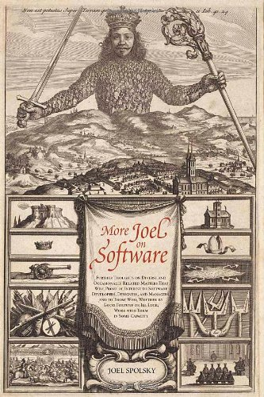
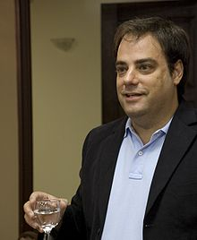

# Introduction to 

# 
 *More Joel on Software*

---

# More Joel on Software

published in 2008

---

# About the author

*Avram Joel Spolsky* (born 1965) is a software engineer and writer. He is the author of Joel on Software, a blog on software development. He was a Program Manager on the Microsoft Excel team between 1991 and 1994. He later founded Fog Creek Software in 2000 and launched the Joel on Software blog. In 2008 he launched the now successful Stack Overflow programmer Q&A site in collaboration with Jeff Atwood. Using the Stack Exchange software product which powers Stack Overflow, The Stack Exchange Network now hosts over 100 Q&A sites.

From <http://en.wikipedia.org/wiki/Joel_Spolsky>