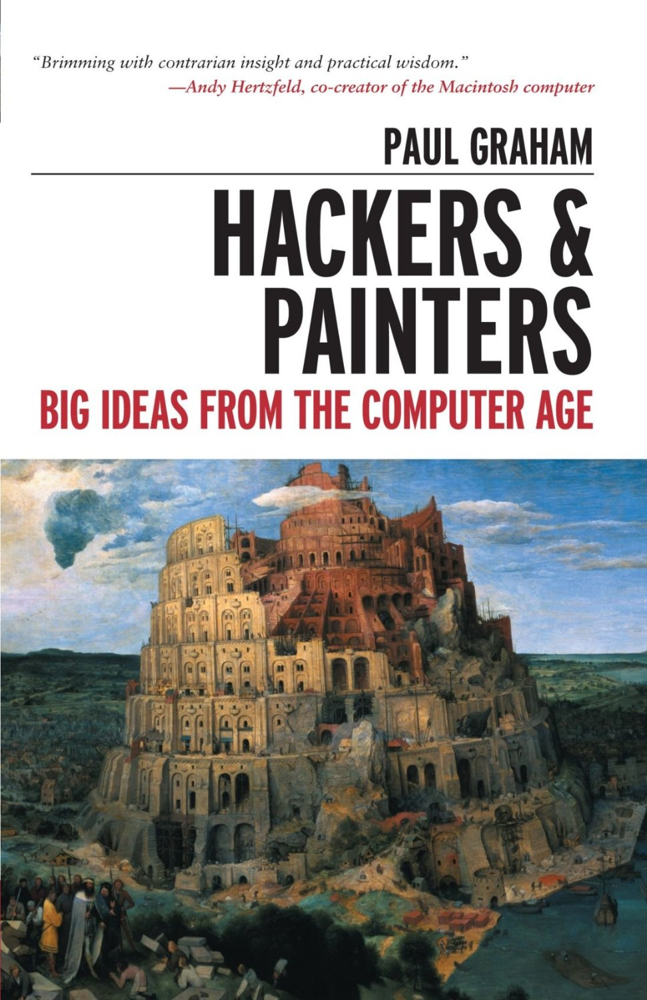
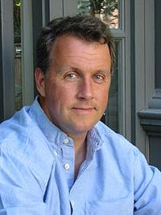

# Introduction to 

# 
 *Hackers & Painters*

---

# Hackers & Painters

published in 2010

---

# About the author

*Paul Graham* (born 1964) is an English programmer, venture capitalist, and essayist. He is known for his work on Lisp, for co-founding Viaweb (which eventually became Yahoo! Store), and for co-founding the Y Combinator seed capital firm. He is the author of On Lisp (1993), ANSI Common Lisp (1995), and the book Hackers & Painters (2004).

From <http://en.wikipedia.org/wiki/Paul_Graham_(computer_programmer)>

----

# Preface

----
