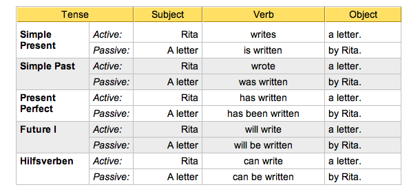
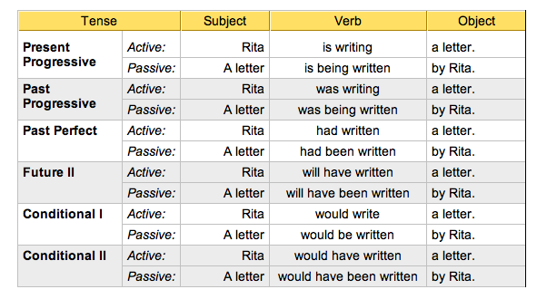
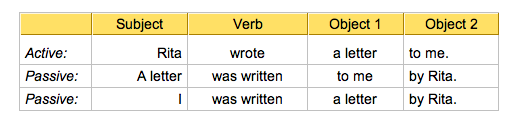

# Passive Voice

*	Use of Passive

	Passive voice is used when the focus is on the action. It is not important or not known, however, who or what is performing the action.

		Example: My bike was stolen.
		
	In the example above, the focus is on the fact that my bike was stolen. I do not know, however, who did it.

	Sometimes a statement in passive is more polite than active voice, as the following example shows:

		Example: A mistake was made.

	In this case, I focus on the fact that a mistake was made, but I do not blame anyone (e.g. You have made a mistake.)

*	Form of Passive

	Subject + finite form of to be + Past Participle

		Example: A letter was written.

	When rewriting active sentences in passive voice, note the following:

	- the object of the active sentence becomes the subject of the passive sentence

	- the finite form of the verb is changed (to be + past participle)

	- the subject of the active sentence becomes the object of the passive sentence (or is dropped)

*	Examples of Passive

*	Passive Sentences with Two Objects

	Rewriting an active sentence with two objects in passive voice means that one of the two objects becomes the subject, the other one remains an object. Which object to transform into a subject depends on what you want to put the focus on.

	
As you can see in the examples, adding by Rita does not sound very elegant. That’s why it is usually dropped.

*	Personal and Impersonal Passive

	
	Personal Passive simply means that the object of the active sentence becomes the subject of the passive sentence. So every verb that needs an object (transitive verb) can form a personal passive.
	
		Example: They build houses. – Houses are built.
	
	Verbs without an object (intransitive verb) normally cannot form a personal passive sentence (as there is no object that can become the subject of the passive sentence). If you want to use an intransitive verb in passive voice, you need an impersonal construction – therefore this passive is called Impersonal Passive.

		Example: he says – it is said

	Impersonal Passive is not as common in English as in some other languages (e.g. German, Latin). In English, Impersonal Passive is only possible with verbs of perception (e. g. say, think, know).

		Example: They say that women live longer than men. – It is said that women live longer than men.

	Although Impersonal Passive is possible here, Personal Passive is more common.

		Example: They say that women live longer than men. – Women are said to live longer than men.

	The subject of the subordinate clause (women) goes to the beginning of the sentence; the verb of perception is put into passive voice. The rest of the sentence is added using an infinitive construction with 'to' (certain auxiliary verbs and that are dropped).

	Sometimes the term Personal Passive is used in English lessons if the indirect object of an active sentence is to become the subject of the passive sentence.
