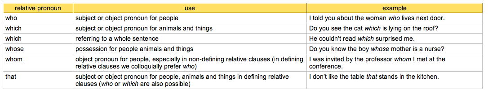
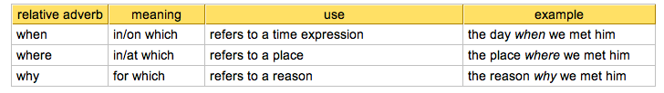

# Attributive clause

Or relative clause

We use relative clauses to give additional information about something without starting another sentence. By combining sentences with a relative clause, your text becomes more fluent and you can avoid repeating certain words.

# How to Form Relative Clauses 
Imagine, a girl is talking to Tom. You want to know who she is and ask a friend whether he knows her. You could say:

	A girl is talking to Tom. Do you know the girl?

That sounds rather complicated, doesn't it? It would be easier with a relative clause: you put both pieces of information into one sentence. Start with the most important thing  – you want to know who the girl is.

	Do you know the girl …

As your friend cannot know which girl you are talking about, you need to put in the additional information  – the girl is talking to Tom. Use „the girl“ only in the first part of the sentence, in the second part replace it with the relative pronoun (for people, use the relative pronoun „who“). So the final sentence is:

	Do you know the girl who is talking to Tom?
	
# Relative Pronouns

# Subject Pronoun or Object Pronoun?

Subject and object pronouns cannot be distinguished by their forms - who, which, that are used for subject and object pronouns. You can, however, distinguish them as follows:

If the relative pronoun is followed by a verb, the relative pronoun is a subject pronoun. Subject pronouns must always be used.

	the apple which is lying on the table

If the relative pronoun is not followed by a verb (but by a noun or pronoun), the relative pronoun is an object pronoun. Object pronouns can be dropped in defining relative clauses, which are then called Contact Clauses.

	the apple (which) George lay on the table
	
#	Relative Adverbs

A relative adverb can be used instead of a relative pronoun plus preposition. This often makes the sentence easier to understand.

	This is the shop in which I bought my bike.
	→ This is the shop where I bought my bike.
	

#	Defining Relative Clauses 

Defining relative clauses (also called identifying relative clauses or restrictive relative clauses) give detailed information defining a general term or expression. Defining relative clauses are not put in commas.

Imagine, Tom is in a room with five girls. One girl is talking to Tom and you ask somebody whether he knows this girl. Here the relative clause defines which of the five girls you mean.

	Do you know the girl who is talking to Tom?

Defining relative clauses are often used in definitions.

	A seaman is someone who works on a ship.

Object pronouns in defining relative clauses can be dropped. (Sentences with a relative clause without the relative pronoun are called Contact Clauses.)

	The boy (who/whom) we met yesterday is very nice.

#	Non-Defining Relative Clauses 

Non-defining relative clauses (also called non-identifying relative clauses or non-restrictive relative clauses) give additional information on something, but do not define it. Non-defining relative clauses are put in commas.

Imagine, Tom is in a room with only one girl. The two are talking to each other and you ask somebody whether he knows this girl. Here the relative clause is non-defining because in this situation it is obvious which girl you mean.

	Do you know the girl, who is talking to Tom?

Note: In non-defining relative clauses, who/which may not be replaced with that.

Object pronouns in non-defining relative clauses must be used.

	Jim, who/whom we met yesterday, is very nice.

#	How to Shorten Relative Clauses?

Relative clauses with who, which, that as subject pronoun can be replaced with a participle. This makes the sentence shorter and easier to understand.

	I told you about the woman who lives next door. – I told you about the woman living next door.

	Do you see the cat which is lying on the roof? – Do you see the cat lying on the roof?