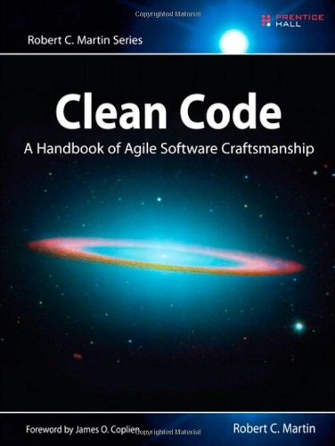

# Introduction to 

# 
 *Clean Code*

---

# Clean Code

published in 2008

---

# About the author

*Robert Cecil Martin*, known colloquially as "Uncle Bob", is an American software consultant and author. Martin has been a software professional since 1970 and an international software consultant since 1990. In 2001, he initiated the meeting of the group that created agile software development from extreme programming techniques. He is also a leading member of the software craftsmanship movement. His video "code casts" on the Clean Coders website can be purchased on www.cleancoders.com. He founded Object Mentor Inc., a consulting firm that specializes in training their clients in C++, Java, OOP, patterns, UML, agile methodologies, and extreme programming. From 1996 to 1999 he was the editor-in-chief of the C++ Report. In 2002 he wrote Agile Software Development: Principles, Patterns, and Practices, which gives pragmatic advice on object-oriented design and development in an agile team.

From <http://en.wikipedia.org/wiki/Robert_Cecil_Martin>

----

# Foreword

----

# Introduction

----

# 1 Clean Code

*	There Will Be Code
*	Bad Code
*	The Total Cost of Owning a Mess
*	The Grand Redesign in the Sky
*	Attitude
*	The Primal Conundrum
*	The Art of Clean Code?
*	What Is Clean Code?

	-	Bjarne Stroustrup, inventor of C++ and author of The C++ Programming Language
	-	Grady Booch, author of Object Oriented Analysis and Design with Applications
	-	“Big” Dave Thomas, founder of OTI, godfather of the Eclipse strategy
	-	Michael Feathers, author of Working Effectively with Legacy Code
	-	Ron Jeffries, author of Extreme Programming Installed and Extreme Programming Adventures in C#
	-	Ward Cunningham, inventor of Wiki, inventor of Fit, coinventor of eXtreme Programming. 
	
*	Schools of Thought
*	We Are Authors
*	The Boy Scout Rule
*	Prequel and Principles
*	Conclusion

----

# 2 Meaningful Names

*	Introduction
*	Use Intention-Revealing Names
*	Avoid Disinformation
*	Make Meaningful Distinctions
*	Use Pronounceable Names
*	Use Searchable Names
*	Avoid Encodings
*	Hungarian Notation
*	Member Prefixes
*	Interfaces and Implementations
*	Avoid Mental Mapping
*	Class Names
*	Method Names
*	Don’t Be Cute
*	Pick One Word per Concept
*	Don’t Pun
*	Use Solution Domain Names
*	Use Problem Domain Names
*	Add Meaningful Context
*	Don’t Add Gratuitous Context
*	Final Words

----

# 3 Functions

*	Small!
*	Blocks and Indenting
*	Do One Thing
*	Sections within Functions
*	One Level of Abstraction per Function
*	Reading Code from Top to Bottom: The Stepdown Rule
*	Switch Statements

		Single Responsibility Principle (SRP) 
		
		http://en.wikipedia.org/wiki/Single_responsibility_principle 
		http://www.objectmentor.com/resources/articles/srp.pdf
		
		Open Closed Principle (OCP)
		
		http://en.wikipedia.org/wiki/Open/closed_principle
		http://www.objectmentor.com/resources/articles/ocp.pdf

*	Use Descriptive Names
*	Function Arguments
*	Common Monadic Forms
*	Flag Arguments
*	Dyadic Functions
*	Triads
*	Argument Objects
*	Argument Lists
*	Verbs and Keywords
*	Have No Side Effects
*	Output Arguments
*	Command Query Separation
*	Prefer Exceptions to Returning Error Codes
*	Extract Try/Catch Blocks
*	Error Handling Is One Thing
*	The Error.java Dependency Magnet
*	Don’t Repeat Yourself
*	Structured Programming
*	How Do You Write Functions Like This?
*	Conclusion

----

# 4 Comments

*	Comments Do Not Make Up for Bad Code
*	Explain Yourself in Code
*	Good Comments

	-	Legal Comments
	-	Informative Comments
	-	Explanation of Intent
	-	Clarification
	-	Warning of Consequences
	-	TODO Comments
	-	Amplification
	-	Javadocs in Public APIs

*	Bad Comments

	-	Mumbling
	-	Redundant Comments
	-	Misleading Comments
	-	Mandated Comments
	-	Journal Comments
	-	Noise Comments
	-	Scary Noise
	-	Don’t Use a Comment When You Can Use a Function or a Variable
	-	Position Markers
	-	Closing Brace Comments
	-	Attributions and Bylines
	-	Commented-Out Code
	-	HTML Comments
	-	Nonlocal Information
	-	Too Much Information
	-	Inobvious Connection
	-	Function Headers
	-	Javadocs in Nonpublic Code
	-	Example

----

# 5 Formatting

*	The Purpose of Formatting

##		Vertical Formatting

*	The Newspaper Metaphor
*	Vertical Openness Between Concepts
*	Vertical Density
*	Vertical Distance

	-	Variable Declarations
	-	Instance variables
	-	Dependent Functions
	-	Conceptual Affinity
	
*	Vertical Ordering

##		Horizontal Formatting

*	Horizontal Openness and Density
*	Horizontal Alignment
*	Indentation

	-	Breaking Indentation
	-	Dummy Scopes

##		Team Rules

##		Uncle Bob’s Formatting Rules

----

# 6	Objects and Data Structures

*	Data Abstraction
*	Data/Object Anti-Symmetry

		Procedural code (code using data structures) makes it easy to add new functions without changing the existing data structures. OO code, on the other hand, makes it easy to add new classes without changing existing functions.
		
		Procedural code makes it hard to add new data structures because all the functions must change. OO code makes it hard to add new functions because all the classes must change.

*	The Law of Demeter 

	<http://en.wikipedia.org/wiki/Law_of_Demeter>

*	Train Wrecks
*	Hybrids
*	Hiding Structure
*	Data Transfer Objects
*	Active Record
*	Conclusion

----

# 7 Error Handling

*	Use Exceptions Rather Than Return Codes
*	Write Your Try-Catch-Finally Statement First
*	Use Unchecked Exceptions
*	Provide Context with Exceptions
*	Define Exception Classes in Terms of a Caller’s Needs
*	Define the Normal Flow
*	Don’t Return Null
*	Don’t Pass Null
*	Conclusion

----

# 8 Boundaries

		by James Grenning
		
*	Using Third-Party Code
*	Exploring and Learning Boundaries

	-	Learning log4j
	-	Learning Tests Are Better Than Free
	
*	Using Code That Does Not Yet Exist
*	Clean Boundaries

----

# 9 Unit Tests

*	The Three Laws of TDD

	-	You may not write production code until you have written a failing unit test.
	-	You may not write more of a unit test than is sufficient to fail, and not compiling is failing.
	-	You may not write more production code than is sufficient to pass the cur- rently failing test.
	
*	Keeping Tests Clean

		Test code is just as important as production code.
		
*	Tests Enable the -ilities
*	Clean Tests
*	Domain-Specific Testing Language
*	A Dual Standard
*	One Assert per Test
*	Single Concept per Test
*	F.I.R.S.T.

	-	Fast
	-	Independent
	-	Repeatable
	-	Self-Validating
	-	Timely
	
*	Conclusion

----

#	10 Classes

		with Jeff Langr

*	Class Organization

	-	Encapsulation

*	Classes Should Be Small!
*	The Single Responsibility Principle
*	Cohesion
*	Maintaining Cohesion Results in Many Small Classes
*	Organizing for Change
*	Isolating from Change
	
----

# 11 Systems

		by Dr. Kevin Dean Wampler

*	How Would You Build a City?
*	Separate Constructing a System from Using It
*	Factories
*	Dependency Injection
*	Scaling Up
*	Cross-Cutting Concerns
*	Java Proxies
*	Pure Java AOP Frameworks
*	AspectJ Aspects
*	Test Drive the System Architecture
*	Optimize Decision Making
*	Use Standards Wisely, When They Add Demonstrable Value
*	Systems Need Domain-Specific Languages
*	Conclusion

----

#	12 Emergence

		by Jeff Langr

*	Getting Clean via Emergent Design		
*	According to Kent, a design is “simple” if it follows these rules:
	-	Runs all the tests
	-	Contains no duplication
	-	Expresses the intent of the programmer
	-	Minimizes the number of classes and methods

----

# 13 Concurrency

		by Brett L. Schuchert

		“Objects are abstractions of processing. Threads are abstractions of schedule.”
														—James O. Coplien

*	Why Concurrency?
*	Myths and Misconceptions
*	Challenges
*	Concurrency Defense Principles

	-	Single Responsibility Principle
	-	Corollary: Limit the Scope of Data
	-	Corollary: Use Copies of Data
	-	Corollary: Threads Should Be as Independent as Possible
	
*	Know Your Library

	-	Thread-Safe Collections
	
*	Know Your Execution Models

	-	Producer-Consumer <http://en.wikipedia.org/wiki/Producer-consumer>
	-	Readers-Writers <http://en.wikipedia.org/wiki/Readers-writers_problem>
	-	Dining Philosophers <http://en.wikipedia.org/wiki/Dining_philosophers_problem>

*	Beware Dependencies Between Synchronized Methods
*	Keep Synchronized Sections Small
*	Writing Correct Shut-Down Code Is Hard
*	Testing Threaded Code
*	Treat Spurious Failures as Candidate Threading Issues
*	Get Your Nonthreaded Code Working First
*	Make Your Threaded Code Pluggable
*	Make Your Threaded Code Tunable
*	Run with More Threads Than Processors
*	Run on Different Platforms
*	Instrument Your Code to Try and Force Failures
*	Conclusion

----

# 14 Successive Refinement

		Case Study of a Command-Line Argument Parser


*	Args Implementation
*	How Did I Do This?
*	Args: The Rough Draft
*	On Incrementalism
*	String Arguments
*	Conclusion

----