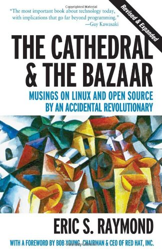
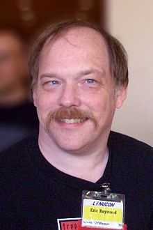

# Introduction to 

# 
 *The Cathedral & the Bazaar*

---

# The Cathedral & the Bazaar

published in 2001

---

# About the author

*Eric Steven Raymond* (born December 4, 1957), often referred to as ESR, is an American computer programmer, author and open source software advocate. After the 1997 publication of The Cathedral and the Bazaar, Raymond was for a number of years frequently quoted as an unofficial spokesman for the open source movement. He is also known for his 1990 edit and later updates of the Jargon File, currently in print as the The New Hacker's Dictionary.

From <http://en.wikipedia.org/wiki/Eric_S._Raymond>

----

# A Brief History of Hackerdom

	http://www.tuxedo.org/jargon
	
*	Prologue: The Real Programmers
*	The Early Hackers
*	The Rise of Unix
*	The End of Elder Days
*	The Proprietary-Unix Era
*	The Early Free Unixes
*	The Great Web Explosion

----

# My Understanding

* open source is much better than closed source
* how to participant into open source
* how to make money from open source
* what the author did in open source

----

# The Cathedral and the Bazaar

*	The Mail Must Get Through
	1. Every good work of software starts by scratching a developer’s personal itch.
	2. Good programmers know what to write. Great ones know what to rewrite (and reuse).
	3. ‘‘Plan to throw one away; you will, anyhow.’’ (Fred Brooks, The Mythical Man-Month, Chapter 11)
	4. If you have the right attitude, interesting prob- lems will find you.
	5. When you lose interest in a program, your last duty to it is to hand it off to a competent successor.
	
*	The Importance of Having Users
	6. Treating your users as co-developers is your least-hassle route to rapid code improvement and effective debugging.
	
*	Release Early, Release Often

	7. Release early. Release often. And listen to your customers.
	8. Given a large enough beta-tester and co-developer base, almost every problem will be characterized quickly and the fix obvious to someone.
	
	"Given enough eyeballs, all bugs are shallow." "Linus’s Law"
	
	Delphi effect

	Linus’s Law can be rephrased as "Debugging is parallelizable".
	
*	Many Eyeballs Tame Complexity
*	When Is a Rose Not a Rose?

	9. Smart data structures and dumb code works a lot better than the other way around.
	
	Author's practice:
	
	-	I released early and often (almost never less often than every 10 days; during periods of intense development, once a day).
	-	I grew my beta list by adding to it everyone who contacted me about fetchmail.
	-	I sent chatty announcements to the beta list whenever I released, encouraging people to participate.
	-	I listened to my beta-testers, polling them about design decisions and stroking them whenever they sent in patches and feedback.

	10. If you treat your beta-testers as if they’re your most valuable resource, they will respond by becoming your most valuable resource.
	
*	Popclient Becomes Fetchmail

	11. The next best thing to having good ideas is rec- ognizing good ideas from your users. Sometimes the latter is better.
	
	12. Often, the most striking and innovative solutions come from realizing that your concept of the problem was wrong.
	
	13. "Perfection (in design) is achieved not when there is nothing more to add, but rather when there is nothing more to take away."
	
*	Fetchmail Grows Up
	
	14. Any tool should be useful in the expected way, but a truly great tool lends itself to uses you never expected.
	
	15. When writing gateway software of any kind, take pains to disturb the data stream as little as possible — and never throw away information unless the recipient forces you to!
	
*	A Few More Lessons from Fetchmail

	16. When your language is nowhere near Turing- complete, syntactic sugar can be your friend.
	
	17. A security system is only as secure as its secret. Beware of pseudo-secrets.
	
*	Necessary Preconditions for the Bazaar Style

	recognize good design ideas from others
	
*	The Social Context of Open-Source Software

	18. To solve an interesting problem, start by finding a problem that is interesting to you.
	19. Provided the development coordinator has a communications medium at least as good as the Internet, and knows how to lead without coercion, many heads are inevitably better than one.

*	On Management and the Maginot Line

	software project management has five functions:

	-	To define goals and keep everybody pointed in the same direc- tion
	-	To monitor and make sure crucial details don’t get skipped
	-	To motivate people to do boring but necessary drudgework
	-	To organize the deployment of people for best productivity
	-	To marshal resources needed to sustain the project

	Enjoyment predicts efficiency.
	
* Epilog: Netscape Embraces the Bazaar

----

# Homesteading the Noosphere

*	An Introductory Contradiction
*	The Varieties of Hacker Ideology
*	Promiscuous Theory, Puritan Practice
*	Ownership and Open Source
*	Locke and Land Title

	Lockean theory of property
	- <http://en.wikipedia.org/wiki/Labor_theory_of_property>
	- <http://en.wikipedia.org/wiki/John_Locke>
		
*	The Hacker Milieu as Gift Culture
	
	Gift cultures are adaptations not to scarcity but to abundance.
	
*	The Joy of Hacking
*	The Many Faces of Reputation
*	Ownership Rights and Reputation Incentives
*	The Problem of Ego
*	The Value of Humility
*	Global Implications of the Reputation-Game Model
*	How Fine a Gift?

	1. If it doesn’t work as well as I have been led to expect it will, it’s no good—no matter how clever and original it is.
	2. Work that extends the noosphere is better than work that duplicates an existing piece of func- tional territory.
	3. Work that makes it into a major distribution is better than work that doesn’t. Work carried in all major distributions is most prestigious.
	4. Utilization is the sincerest form of flattery— and category killers are better than also-rans.
	5. Continued devotion to hard, boring work (like debugging, or writing documentation) is more praiseworthy than cherrypicking the fun and easy hacks.
	6. Nontrivial extensions of function are better than low-level patches and debugging.
	
*	Noospheric Property and the Ethology of Territory
*	Causes of Conflict
	-	Who gets to make binding decisions about a project?
	-	Who gets credit or blame for what?
	-	How to reduce duplication of effort and prevent rogue versions from complicating bug tracking?
	-What is the Right Thing, technically speaking?
	
*	Project Structures and Ownership
*	Conflict and Conflict Resolution
	
	two criteria
	-	“authority follows responsibility” 
	-	“seniority wins”
	
*	Acculturation Mechanisms and the Link to Academia

	three levels:
	-	Password-like specific mysteries.
	-	The requirement of initiation into certain technical mysteries.
	-	Social-context mysteries.

*	Gift Outcompetes Exchange
*	Conclusion: From Custom to Customary Law

	Malvern Protocol <http://www.laetusinpraesens.org/docs00s/gated.php>
	
*	Questions for Further Research

----

# The Magic Cauldron

*	Indistinguishable from Magic

		Ceridwen’s cauldron <http://en.wikipedia.org/wiki/Ceridwen>

		ephemeralization, technology becoming both more effective and less expensive as the physical resources invested in early designs are replaced by more and more information content.

			Buckminster Fuller <http://en.wikipedia.org/wiki/Buckminster_Fuller>

		"Any sufficiently advanced technology is indistin- guishable from magic"
		
			Arthur C. Clarke <http://en.wikipedia.org/wiki/Arthur_C._Clarke>
			
*	Beyond Geeks Bearing Gifts
*	The Manufacturing Delusion

	-	use value 
	-	sale value

			In professional economist-speak, sale value is value as a final good, and use value is value as an intermediate good.
			
*	‘factory model’ premises
	-	Most developer time is paid for by sale value.
	-	The sale value of software is proportional to its development cost and to its use value.

*	approximately 95% of code is still written in-house.

*	most programmer-hours are spent (and most programmer salaries are paid for) writing or maintaining in-house code that has no sale value at all.	

*	the price a consumer will pay is effectively capped by the expected future value of vendor service (where “service” is here construed broadly to include enhancements, upgrades, and follow-on projects).

*	In other words, software is largely a service industry operating under the persistent but unfounded delusion that it is a manufac- turing industry.

*	The "Information Wants to Be Free" Myth

*	The Inverse Commons
	
	Garret Hardin’s "Tragedy of the Commons"
	-	<http://en.wikipedia.org/wiki/Garrett_Hardin>
	-	<http://en.wikipedia.org/wiki/Tragedy_of_the_commons>
	
*	Reasons for Closing Source

*	Use-Value Funding Models

	-	The Apache Case: Cost-Sharing
		*	Buy a proprietary web server.
		*	Roll your own.
		*	Join the Apache group.
		
	_	The Cisco Case: Risk-Spreading
			
*	Why Sale Value Is Problematic

*	Indirect Sale-Value Models
	-	Loss-Leader/Market Positioner
	-	Widget Frosting
	-	Give Away the Recipe, Open a Restaurant
	-	Accessorizing
	-	Free the Future, Sell the Present
	-	Free the Software, Sell the Brand
	-	Free the Software, Sell the Content
	
*	When to Be Open, When to Be Closed
	-	What Are the Payoffs?
	-	How Do They Interact?
	
*	following discriminators push towards open source
	1. Reliability/stability/scalabilityarecritical.
	2. Correctness of design and implementation cannot readily be verified by means other than independent peer review.
	3. The software is critical to the user’s control of his/her busi- ness.
	4. The software establishes or enables a common computing and communications infrastructure.
	5. Key methods (or functional equivalents of them) are part of common engineering knowledge.

*	Doom: A Case Study

*	Knowing When to Let Go

*	Open Source as a Strategic Weapon
	-	Cost-sharing as a Competitive Weapon
	-	Resetting the Competition
	-	Growing the Pond
	-	Preventing a Chokehold
	
*	Open Source and Strategic Business Risk
	
*	The Business Ecology of Open Source

*	Coping with Success

*	Open R&D and the Reinvention of Patronage

*	Getting There from Here

*	Conclusion: Life After the Revolution

*	Afterword: Why Closing a Drivers Loses Its Vendor Money

----

# Revenge of the Hackers

*	Beyond Brooks’s Law
*	Memes and Mythmaking
*	The Road to Mountain View

		Thomas Paine <http://en.wikipedia.org/wiki/Thomas_Paine>
		
*	The Origins of ‘Open Source’
*	Key themes
	1. Forget Bottom-Up; Work on Top-Down
	2. Linux Is Our Best Demonstration Case
	3. Capture the Fortune 500
	4. Co-opt the Prestige Media that Serve the Fortune 500
	5. Educate Hackers in Guerrilla Marketing Tactics
	6. Use the Open Source Certification Mark to Keep Things Pure

*	The Accidental Revolutionary
*	Phases of the Campaign
*	The Facts on the Ground
*	Into the Future

----

# AFTERWORD Beyond Software?

----

# APPENDIX A How to Become a Hacker

*	Why This Document?
*	What Is a Hacker?
*	The Hacker Attitude
	1. The world Is Full of Fascinating Problems Wait- ing to Be Solved.
	2. Nobody Should Ever Have to Solve a Problem Twice.
	3. Boredom and Drudgery Are Evil.
	4. Freedom Is Good.
	5. Attitude Is No Substitute for Competence.
	
*	Basic Hacking Skills
	1. Learn How to Program.
	2. Get One of the Open-Source Unixes and Learn to Use and Run It.
	3. Learn How to Use the World Wide Web and Write HTML.

*	Status in the Hacker Culture
	1. Write Open-Source Software
	2. Help Test and Debug Open-Source Software
	3. Publish Useful Information
	4. Help Keep the Infrastructure Working
	5. Serve the Hacker Culture Itself
	
*	The Hacker/Nerd Connection
*	Points for Style
*	Other Resources
*	Frequently Asked Questions
	-	HTML: The Definitive Guide (http://www.oreilly.com/catalog/html3/)

----

# APPENDIX B Statistical Trends in the Fetchmail Project’s Growth

----

# Notes, Bibliography, and Acknowledgments

*	SNAFU principle 

----