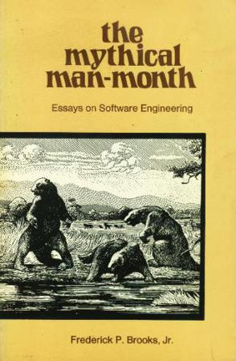

# Introduction to 

# 
 *The Mythical Man-Month*

---

# The Mythical Man-Month v1.0

published in 1975

---

# The Mythical Man-Month v2.0

published in 1995

---

# About the author

*Frederick P.Brooks，Jr.* won the Turing Award in 1999 for "landmark contributions to computer architecture, operating systems, and software engineering."

He was the manager for the development of the System/360 family of computers and the OS/360 software package. He later wrote candidly about the process in his seminal book The Mythical Man-Month.

From <http://en.wikipedia.org/wiki/Fred_Brooks>

