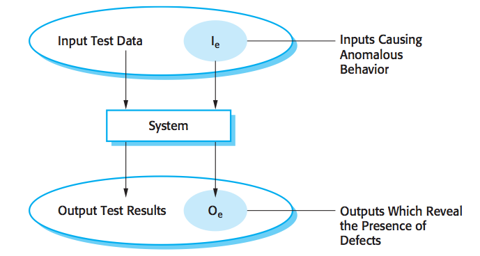
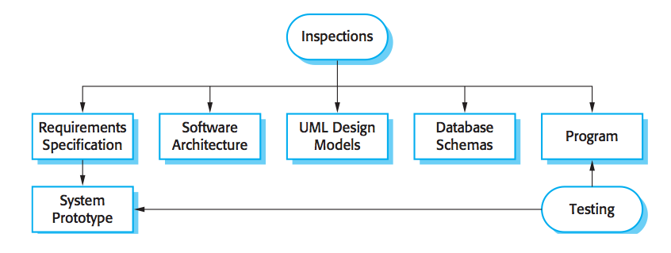
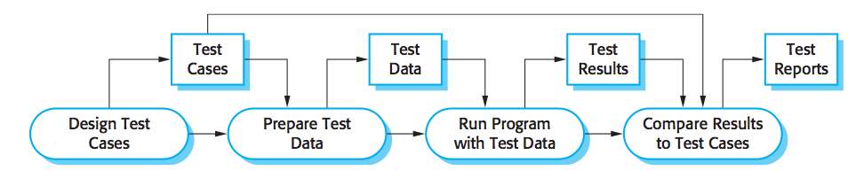
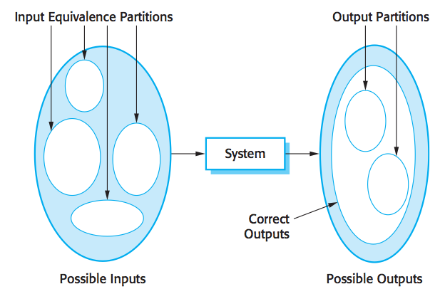
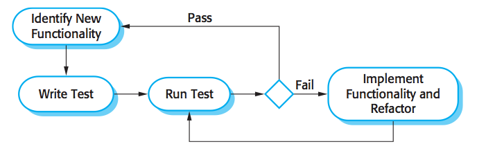

# Specialized English for Software Engineering    Trial Lecture

  
Lecturer：Tian Siyuan

Email:    <tiansiyuan@gmail.com>

---

# Table of Contents

*	[Software Testing concepts](#part1)

*	[English in software testing](#part2)

*	[Introduction to *The Mythical Man\-Month*](#part3)

*	[How to write an abstract for the master thesis?](#part4)

---

# PART I: Software Testing concepts

*	Development testing

*	Test-driven development

*	Release testing

*	User testing

---

# Two goals of testing

*	To demonstrate the software meets its requirements
	
	validation testing
	
*	To discover defects

	defect testing
	
	Testing can only show the presence of errors, not their absence. 
	
								Edsger Dijkstra
	

---

# input/output model of program testing

---

# Verification & Validation

*	‘Validation: Are we building the right product?’

*	‘Verification: Are we building the product right?’

                               Barry Boehm

---

# Inspections & testing

---

# Three stages of testing

*	Development testing

*	Release testing

*	User testing

	Acceptance testing
	
---

# software testing process

---

# Development testing

primarily a defect testing process, to discover bugs

*	Unit testing

	- test the functionality of objects or methods

*	Component testing

	- test component interfaces

*	System testing
    - test component interactions

---

# Unit testing

test program components, such as methods or object classes

*	test all operations

*	set and check the value of all attributes

*	put the object into all possible states

Generalization or inheritance makes object class testing more complicated.

If possible, automate unit testing, with a test automation framework.

---

# Three parts of automated tests



*	setup
	-	initialize the system with test cases

*	call
	-	call the object or method to be tested

*	assertion
	-	compare the result of the call with the expected result




---

# two strategies for choosing test cases

*	Partition testing
	-	identify groups of inputs that have common characteristics and should be processed in the same way, choose tests from within each of these groups.

*	Guideline based testing
	-	use testing guidelines to choose test cases, while guideline reflects previous experience of errors programmers often make.


---

# Equivalence partitioning



---




---

# General guidelines to test case design


*	Choose inputs that force the system to generate all error messages

*	Design inputs that cause input buffers to overflow

*	Repeat the same input or series of inputs numerous times

*	Force invalid outputs to be generated

*	Force computation results to be too large or too small

---

# Component testing

*	focus on showing that the component interface behaves according to its specification;


*	assume that unit tests on the individual objects within the component have been completed.

---


# Different types of interface


*	Parameter interfaces

*	Shared memory interfaces

	often used in embedded systems

*	Procedural interfaces

*	Message passing interfaces

	object\-oriented systems
	
	client\-server systems

	
---

# Interface errors

*	Interface misuse
	
	common with parameter interfaces
	

*	Interface misunderstanding

*	Timing errors

	in real\-time systems that use a shared memory or a message\-passing interface


---


# General guidelines for interface testing


*	extreme value

*	null pointer

*	deliberately cause the component to fail

*	stress testing in message passing systems

*	vary the activation order of the components interacting through shared memory

Inspections and reviews can sometimes be more cost effective than testing for
discovering interface errors.

---

# System testing


involves integrating components to create a version of the system and then testing the integrated system.


differences from component testing:

*	System testing is after component testing.

*	System testing is a collective rather than an individual process.

focus on testing the interactions between the components and objects that make up a system.


use case\-based testing is an effective approach to system testing.

---


# Policy choosing test cases


Exhaustive testing is impossible.

*	All system functions that are accessed through menus should be tested.

*	Combinations of functions accessed through the same menu must be tested.

*	All functions must be tested with both correct and incorrect input.

---

# Test\-driven development (TDD)

*	develop the code incrementally with a test must pass.

*	introduced as part of agile methods such as Extreme Programming. 

*	can also be used in plan\-driven development processes.

---

# Benefits of TDD

*	Clarify the purpose of a code segment

*	Code coverage

*	Regression testing

*	Simplified debugging

*	System documentation

---

# Release testing

*	testing a particular release of a system that is intended for use outside of the development team.

*	primary goal is to convince the supplier of the system that it is good enough for use.

---

# Release testing vs. system testing

*	separate team responsible for release testing

*	to check that the system meets requirements and is good enough for external use

---

# 3 classes of release testing

*	Requirements\-based testing

	validate that system has properly implemented its requirements.

*	Scenario testing

	devise typical scenarios of use and develop test cases accordingly.

*	Performance testing

	to ensure that the system can process its intended load.

---

# Three types of user testing

	
user doing system testing

*	Alpha testing

*	Beta testing

*	Acceptance testing

---

# 6 stages in the acceptance testing

Acceptance testing is an inherent part of custom systems development.

*	Define acceptance criteria

*	Plan acceptance testing

*	Derive acceptance tests

*	Run acceptance tests

*	Negotiate test results

*	Reject/accept system

---

# Acceptance testing process

---

# Related topics

*	Test planning

*	Debugging

*	Path testing

*	Incremental integration and testing

---

# The structure of a test plan

*	The testing process

*	Requirements traceability

*	Tested items

*	Testing schedule

*	Test recording procedures

*	Hardware and software requirements

*	Constraints

*	System tests

---

# Conclusion

---

# PART II

 
 

 English in software testing 

---

# specialized vocabulary composition

*	derivation

*	compounding

*	blending

*	shortening
	
*	borrowing

---

# derivation

*	prefix

	-	superhighway, supercomputer
	-	hypertext, hypercube
	-	microprocessor, microkernel
	-	polymorphism, polytechnic
	-	telephone, teletext
	-	multiprogram, multimedia
	-	interface, internet
	-	unicode
	-	monochrome
	-	homogeneous
	-	semiconductor
	-	hemicycle
	
---

# derivation

*	suffix

	-	telescope, spectroscope
	-	enable, disable, programmable, portable, scalable
	-	firmware, groupware, freeware, software
	-	accountability, integrity, confidentiality

---

# compounding

*	file\-based

*	object\-oriented

*	info\-channel

*	user\-centric

*	paper\-free

*	test\-driven

---

# blending

*	codec (coder + decoder)

*	transeiver (transmitter + receiver)

*	syscall (system + call)

---

# shortening

*	compress and omit

	-	id (identifier)
	-	f1u (influenza)
	-	math (mathematics)
	-	lab (laboratory)
	-	ad (advertisement)

---

# shortening

	
*	acronym

	-	flops (floating\-point Operation Per Second) 
	-	spool (simultaneous peripheral operation on line)
	
	-	BASIC (Beginner's All\-purpose Symbolic Instruction Code)
	-	FORTRAN (Formula Translation)
	-	COBOL (Common Business Oriented Language)
	
	-	RISC (Reduced Instruction Set Computer)
	-	IDE (Integrated Development Environment)
	-	PCB (Process Control Block)
	
	-	i18n, l10n, a11y

---
	
# borrowing

*	flag

*	cache

*	semaphore

*	firewall

*	scratchpad

---

# PART III

 
 

 Introduction to *The Mythical Man-Month* 

---

# The Mythical Man-Month v1.0

published in 1975

---

# The Mythical Man-Month v2.0

published in 1995

---

# About the author

Frederick P.Brooks，Jr. won the Turing Award in 1999 for "landmark contributions to computer architecture, operating systems, and software engineering."

He was the manager for the development of the System/360 family of computers and the OS/360 software package. He later wrote candidly about the process in his seminal book The Mythical Man-Month.

From <http://en.wikipedia.org/wiki/Fred_Brooks>

---

# PART IV

 
 

 How to write an abstract for the master thesis? 

---

# What is an abstract

*	a summary of the whole thesis
	-	It presents all the major elements of the thesis work in a highly condensed form.

*	a preface, preamble, or advance organizer
	-	It prepares the reader for the thesis.

*	substitutes for the whole thesis
	-	when there is insufficient time and space for the full text.

---

#	size & structure

*	maximum sizes for abstracts submitted to Canada's National Archive are 150 words (Masters thesis) and 350 words (Doctoral dissertation).

*	limit the abstract for doctoral dissertation to one double-spaced page, about 280 words.

*	An abstract word limit of 150 to 200 words is common.

*	The structure should mirror the structure of the whole thesis, and should represent all its major elements.

---

# Parts of an Abstract

*	Motivation
	-	Why do we care about the problem and the results?
	
*	Problem statement
	-	What problem are you trying to solve? 
	
*	Approach
	-	How did you go about solving or making progress on the problem?
	
*	Results
	-	What's the answer?
	
*	Conclusions
	-	What are the implications of your answer?

*	Key words & Classified no

---

# Problems

*	format

*	not complete

*	too much background information

*	paper -> thesis/dissertation

*	I -> the writer, or use passive voice

---

# Examples

*	[example 1](abstract/example-1.pdf)

*	[example 2](abstract/example-2.pdf)

*	[example 3](abstract/example-3.pdf)

